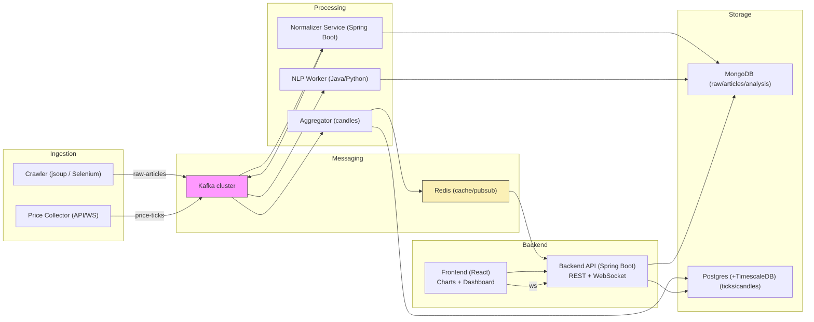
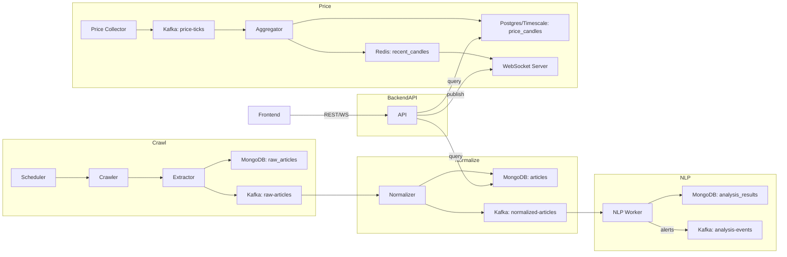

# Architecture Overview

Purpose: This system ingests financial news from multiple sources, stores raw and processed data, runs AI/NLP analysis, and provides realtime price charts similar to TradingView.

## Architecture summary (Java stack)

- Crawler/Extractor: Java (jsoup for HTML parsing, Selenium for dynamic pages). Deployed as workers (Spring Boot apps or standalone JVM processes). Scheduler: Quartz or Kubernetes CronJob.

- Message broker: Apache Kafka (streaming between crawler → normalizer → NLP → aggregator).

- Processing/Workers: Spring Boot microservices (Normalizer, NLP Worker, Aggregator). Workers scale as Kafka consumer groups.
- Storage:

  - PostgreSQL (+ TimescaleDB extension) for relational and time-series data (price ticks/candles).

  - MongoDB for raw articles and NLP results (document store).
  - Redis for cache and pub/sub bridging to WebSocket server.
- Backend API: Spring Boot (REST + WebSocket). Exposes endpoints: `/api/news`, `/api/prices/historical`, `/ws/prices`.
- Frontend: React (SPA). Charting: TradingView Charting Library or Lightweight Charts. Realtime via WebSocket.
- Observability: Prometheus + Grafana for metrics; ELK/EFK for logs; Zipkin/Jaeger for tracing.

## High-level data flow

1. The crawler fetches source pages → pushes raw HTML messages to Kafka topic `raw-articles` and stores raw documents in MongoDB `raw_articles`.

2. The Normalizer (consumer) reads `raw-articles`, parses and normalizes them into a common schema, stores `articles` in MongoDB and publishes `normalized-articles` to Kafka.
3. The NLP Worker (consumer) consumes `normalized-articles`, runs language detection, NER, sentiment, topic modeling and causal signal detection → stores `analysis_results` in MongoDB and may publish `analysis-events` for alerts.
4. The Price Collector connects to exchange APIs/WebSockets → stores ticks into TimescaleDB/Postgres (`price_ticks`) and publishes ticks to Kafka `price-ticks`.
5. The Aggregator (consumer) reads ticks → generates candles for configured intervals (1m,5m,...) → stores `price_candles` in Postgres/Timescale and updates Redis cache / publishes realtime updates via Redis pub/sub.
6. The Backend API serves frontend requests by reading from Postgres/Mongo/Redis; a WebSocket server subscribes to Redis channels to broadcast realtime updates to clients.

## Non-functional requirements

- Realtime latency: target <1s from tick to client.

- Scalability: Crawler, NLP, and Aggregator must scale horizontally using Kafka consumer groups.
- Idempotency: Crawl/normalize steps must dedupe using URL/hash to avoid duplicates.
- Data retention & backup: raw_articles retained for configurable period; aggregated candles archived as required; backup strategies for PostgreSQL and MongoDB.

## Suggested technology stack

- Language/Framework: Java 17+, Spring Boot, Spring Kafka.

- Parsing: jsoup, Selenium (headless) when necessary.
- Message broker: Kafka.
- Databases: PostgreSQL with TimescaleDB, MongoDB, Redis.
- Observability: Prometheus, Grafana, ELK, Zipkin/Jaeger.
- Orchestration: Docker Compose for development; Kubernetes for production.

## Diagrams (Mermaid)

### System-level architecture

### Dataflow (detailed)

