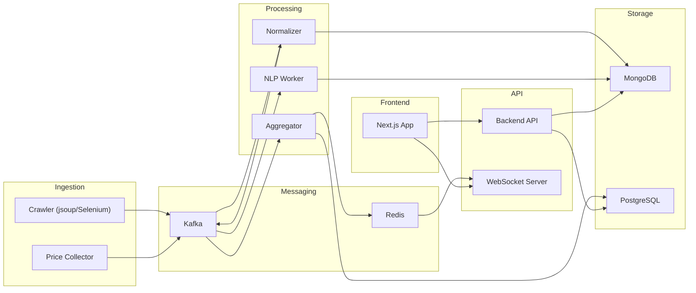
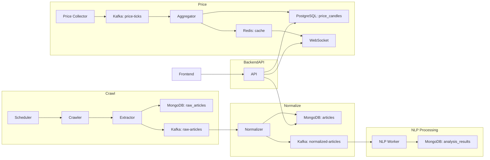

# Architecture Overview

This document describes the evolutionary architecture for the Trading Platform, designed to scale from 1 user to 1,000,000 concurrent users. The architecture evolves through distinct phases, each with clear rationale for upgrades.

> **Note**: For monitoring, security, Kubernetes, and CI/CD details, see [Operations.md](./Operations.md).

---

## Table of Contents

1. [System Purpose](#system-purpose)
2. [Evolutionary Architecture Phases](#evolutionary-architecture-phases)
3. [Technology Stack](#technology-stack)
4. [Data Flow](#data-flow)
5. [Architecture Diagrams](#architecture-diagrams)

---

## System Purpose

The system ingests financial news from multiple sources, stores raw and processed data, runs AI/NLP analysis, and provides real-time price charts similar to TradingView.

**Core Requirements** (from CoreRequirements.md):
1. Financial News Crawler - Multi-source collection with adaptive HTML parsing
2. Real-time Price Charts - WebSocket-based updates, multiple timeframes
3. AI/NLP Analysis - Sentiment analysis, trend prediction
4. Account Management - User authentication and preferences

---

## Evolutionary Architecture Phases

### Phase 1: Monolithic Foundation (1-10 users)

**Architecture**: Single Spring Boot application with embedded services.

```
┌─────────────────────────────────────────────────┐
│                 Spring Boot App                  │
│  ┌──────────┐ ┌──────────┐ ┌──────────────────┐ │
│  │ REST API │ │ Crawler  │ │ Price Collector  │ │
│  └──────────┘ └──────────┘ └──────────────────┘ │
│  ┌──────────┐ ┌──────────┐                      │
│  │ WebSocket│ │   NLP    │                      │
│  └──────────┘ └──────────┘                      │
└─────────────────────────────────────────────────┘
                      │
              ┌───────┴───────┐
              │  PostgreSQL   │
              │  (All data)   │
              └───────────────┘
```

**Rationale**:
- Simplest possible architecture for initial development
- Single deployment unit reduces operational complexity
- PostgreSQL handles both structured and JSON data (JSONB)
- Rapid iteration and debugging

**Components**:
- Single Spring Boot application with all modules
- PostgreSQL for all data storage (using JSONB for flexible schemas)
- Scheduled tasks (Spring @Scheduled) for crawling
- Simple WebSocket for real-time updates

---

### Phase 2: Database Optimization (10-1,000 users)

**Architecture**: Monolith with specialized data stores.

```
┌─────────────────────────────────────────────────┐
│                 Spring Boot App                  │
│  ┌──────────┐ ┌──────────┐ ┌──────────────────┐ │
│  │ REST API │ │ Crawler  │ │ Price Collector  │ │
│  └──────────┘ └──────────┘ └──────────────────┘ │
│  ┌──────────┐ ┌──────────┐                      │
│  │ WebSocket│ │   NLP    │                      │
│  └──────────┘ └──────────┘                      │
└─────────────────────────────────────────────────┘
         │              │              │
    ┌────┴────┐    ┌────┴────┐    ┌────┴────┐
    │PostgreSQL│    │MongoDB  │    │ Redis   │
    │(prices)  │    │(articles)│   │(cache)  │
    └──────────┘    └──────────┘   └─────────┘
```

**Rationale**:
- PostgreSQL optimized for time-series price data
- MongoDB better suited for variable-schema article documents
- Redis provides caching layer for frequently accessed data
- Reduces database contention

**Key Changes**:
- Add MongoDB for raw articles and NLP results
- Add Redis for caching and session management
- PostgreSQL focuses on structured price data
- Connection pooling (HikariCP) for database efficiency

---

### Phase 3: Service Separation (100-1,000 users)

**Architecture**: Modular monolith with clear boundaries.

```
┌───────────────────────────────────────────────────────────────┐
│                         API Gateway                            │
│                    (Spring Cloud Gateway)                      │
└─────────────────────────────┬─────────────────────────────────┘
                              │
    ┌─────────────────────────┼─────────────────────────────┐
    │                         │                             │
┌───┴────┐              ┌─────┴─────┐              ┌────────┴───────┐
│  API   │              │  Crawler  │              │ Price Service  │
│Service │              │  Service  │              │                │
└───┬────┘              └─────┬─────┘              └────────┬───────┘
    │                         │                             │
    └─────────────────────────┼─────────────────────────────┘
                              │
              ┌───────────────┼───────────────┐
              │               │               │
         PostgreSQL        MongoDB          Redis
```

**Rationale**:
- API Gateway provides single entry point, routing, and load balancing
- Logical service boundaries prepare for future microservices
- Each service can be developed and tested independently
- Easier to scale specific components

**Key Changes**:
- Introduce Spring Cloud Gateway as API Gateway
- Split into logical modules (still single deployable)
- Define clear interfaces between modules
- Add basic health checks

---

### Phase 4: Async Processing (1,000-10,000 users)

**Architecture**: Event-driven with message queue.

```
┌──────────────────────────────────────────────────────────────────┐
│                          API Gateway                              │
└───────────────────────────────┬──────────────────────────────────┘
                                │
        ┌───────────────────────┼───────────────────────────┐
        │                       │                           │
  ┌─────┴─────┐           ┌─────┴─────┐             ┌───────┴──────┐
  │    API    │           │  Crawler  │             │    Price     │
  │  Service  │           │  Service  │             │   Service    │
  └─────┬─────┘           └─────┬─────┘             └───────┬──────┘
        │                       │                           │
        │                       └───────────┬───────────────┘
        │                                   │
        │                           ┌───────┴───────┐
        │                           │     Kafka     │
        │                           └───────┬───────┘
        │                                   │
        │                           ┌───────┴───────┐
        │                           │  NLP Worker   │
        │                           │  (Consumer)   │
        │                           └───────────────┘
        │
┌───────┴─────────────────────────────────────────┐
│               Data Layer                         │
│  PostgreSQL    │    MongoDB    │    Redis        │
└──────────────────────────────────────────────────┘
```

**Rationale**:
- Kafka decouples data ingestion from processing
- NLP workers can scale independently based on queue depth
- Better fault tolerance - messages are persisted if workers fail
- Enables replay of events for reprocessing

**Key Changes**:
- Introduce Apache Kafka for event streaming
- NLP processing becomes async consumer
- Price aggregation as Kafka consumer
- Crawler publishes to Kafka topics

---

### Phase 5: Microservices (10,000-100,000 users)

**Architecture**: Full microservices with independent deployments.

```
┌─────────────────────────────────────────────────────────────────────────┐
│                           Load Balancer                                  │
└────────────────────────────────┬────────────────────────────────────────┘
                                 │
┌────────────────────────────────┴────────────────────────────────────────┐
│                           API Gateway                                    │
│                      (Rate limiting, Routing)                            │
└────────────────────────────────┬────────────────────────────────────────┘
                                 │
     ┌──────────┬────────────────┼────────────────┬──────────┐
     │          │                │                │          │
┌────┴────┐ ┌───┴───┐ ┌──────────┴────────┐ ┌─────┴────┐ ┌───┴────┐
│   API   │ │Crawler│ │  Price Service    │ │   NLP    │ │ Auth   │
│ Service │ │Service│ │ (Collector+Agg)   │ │ Service  │ │Service │
└────┬────┘ └───┬───┘ └────────┬──────────┘ └────┬─────┘ └───┬────┘
     │          │              │                 │           │
     └──────────┴──────────────┼─────────────────┴───────────┘
                               │
                        ┌──────┴──────┐
                        │    Kafka    │
                        └──────┬──────┘
                               │
┌──────────────────────────────┴──────────────────────────────┐
│                         Data Layer                           │
│   PostgreSQL   │   MongoDB   │   Redis   │   TimescaleDB     │
└──────────────────────────────────────────────────────────────┘
```

**Rationale**:
- Each service scales independently
- Team autonomy - different teams own different services
- Technology flexibility per service
- Fault isolation - one service failure doesn't cascade

**Key Changes**:
- Deploy services as separate containers
- Add service discovery (Spring Cloud)
- TimescaleDB for optimized time-series queries
- Independent database per service (where appropriate)

---

### Phase 6: CQRS & Event Sourcing (100,000-1,000,000 users)

**Architecture**: Command Query Responsibility Segregation with event sourcing.

```
┌─────────────────────────────────────────────────────────────────────────────┐
│                              Load Balancer                                   │
└──────────────────────────────────┬──────────────────────────────────────────┘
                                   │
┌──────────────────────────────────┴──────────────────────────────────────────┐
│                              API Gateway                                     │
└──────────────────────────────────┬──────────────────────────────────────────┘
                                   │
              ┌────────────────────┴────────────────────┐
              │                                         │
      ┌───────┴───────┐                        ┌────────┴────────┐
      │  COMMAND SIDE │                        │   QUERY SIDE    │
      │               │                        │                 │
      │ ┌───────────┐ │                        │ ┌─────────────┐ │
      │ │  Write    │ │                        │ │   Read      │ │
      │ │  Services │ │                        │ │  Services   │ │
      │ └─────┬─────┘ │                        │ └──────┬──────┘ │
      │       │       │                        │        │        │
      │ ┌─────┴─────┐ │      ┌─────────┐       │ ┌──────┴──────┐ │
      │ │Event Store│─┼──────│  Kafka  │───────┼─│ Read Models │ │
      │ └───────────┘ │      └─────────┘       │ └─────────────┘ │
      └───────────────┘                        └─────────────────┘
              │                                         │
              └─────────────────┬───────────────────────┘
                                │
┌───────────────────────────────┴───────────────────────────────┐
│                           Data Layer                           │
│ Event Store │ PostgreSQL │ MongoDB │ Redis │ Elasticsearch     │
└────────────────────────────────────────────────────────────────┘
```

**Rationale**:
- Separate read and write models optimize for specific access patterns
- Event sourcing provides complete audit trail
- Read models can be materialized views optimized for queries
- Enables complex event processing and analytics

**Key Changes**:
- Implement CQRS pattern for high-traffic endpoints
- Event store for command audit trail
- Elasticsearch for full-text search on articles
- Multiple read model projections

---

## Technology Stack

| Category | Technology | Rationale |
|----------|------------|-----------|
| **Backend** | Java 17+, Spring Boot 3.x | Enterprise-grade, extensive ecosystem |
| **Frontend** | Next.js, React | Server-side rendering, real-time capabilities |
| **Relational DB** | PostgreSQL | Robust, supports JSONB, mature |
| **Document DB** | MongoDB | Flexible schema for articles |
| **Cache** | Redis | High-performance caching, pub/sub |
| **Message Broker** | Apache Kafka | Durable event streaming (Phase 4+) |
| **Time-series** | TimescaleDB | Optimized for price data (Phase 5+) |
| **Search** | Elasticsearch | Full-text search (Phase 6) |
| **Web Parsing** | jsoup, Selenium | HTML parsing, dynamic content |

---

## Data Flow

### Core Data Flow (All Phases)

1. **News Ingestion**: Crawler fetches pages → parses content → stores articles
2. **Price Collection**: Connects to exchange APIs → stores ticks → generates candles
3. **NLP Processing**: Reads articles → runs analysis → stores results
4. **Client Serving**: API serves data → WebSocket broadcasts updates

### Phase-Specific Flows

**Phases 1-3 (Synchronous)**:
```
Crawler → DB → API → Client
```

**Phases 4-6 (Asynchronous)**:
```
Crawler → Kafka → Workers → DB → API → Client
                    ↓
              Redis (cache) → WebSocket → Client
```

---

## Architecture Diagrams

### System Overview (Phase 5 Target)



### Data Flow Diagram



---

## Non-functional Requirements

| Requirement | Target | Phase |
|-------------|--------|-------|
| API Latency | < 200ms (p95) | All |
| WebSocket Latency | < 1s tick-to-client | All |
| Throughput | 1000 req/s | Phase 4+ |
| Availability | 99.9% | Phase 5+ |
| Data Retention | 90 days raw, 1 year aggregated | All |

---

## References

- [CoreRequirements.md](./CoreRequirements.md) - Business requirements
- [ProjectPlan.md](./ProjectPlan.md) - Implementation timeline
- [Features.md](./Features.md) - Feature specifications
- [Operations.md](./Operations.md) - Monitoring, security, and deployment


