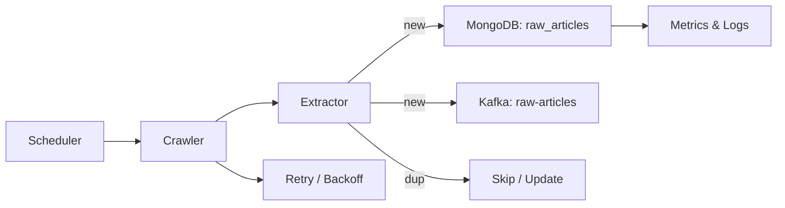
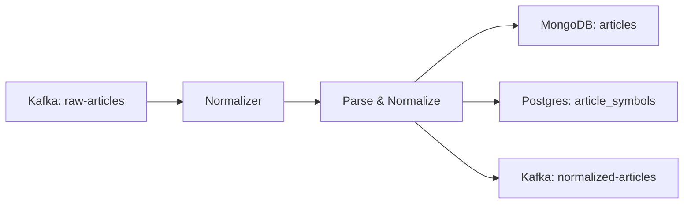
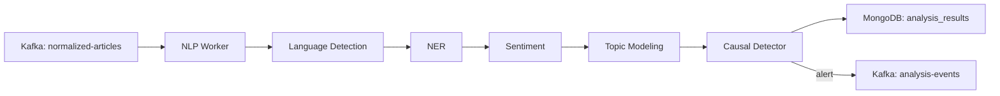
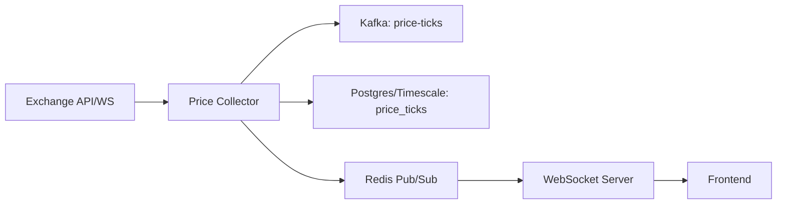
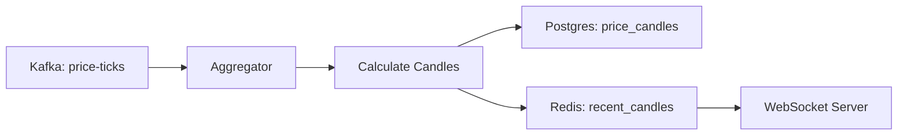
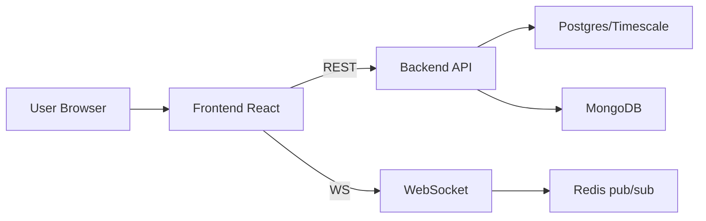
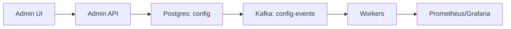
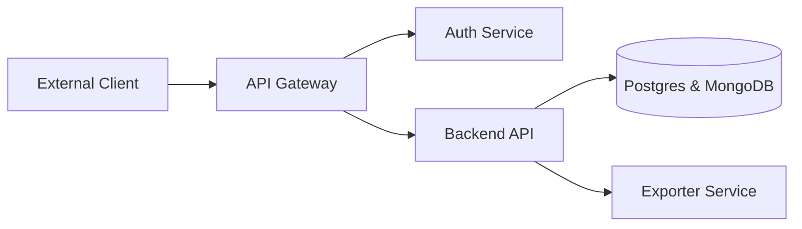

# Features and Functional Flows

Based on the project description, here are the main features, their functional flows, and acceptance criteria.

## 1) News Ingestion (Crawler)
- Description: Automatically collect articles from multiple sources and store raw HTML + metadata.
- Flow:
  1. Scheduler (Quartz/Kubernetes Cron) selects sources to crawl.
  2. Crawler fetches pages (HTTP client or headless Selenium when JS rendering is necessary).
  3. Extractor uses selectors/heuristics to extract title, body, publish date, authors, tags, and referenced symbols.
  4. Publish a message to Kafka topic `raw-articles` and persist the raw payload in MongoDB `raw_articles`.
- Acceptance criteria: dedupe by URL/hash, retry on failure, and crawl success rate >= 90% per source.

## 2) Normalization & Storage
- Description: Normalize article content into a common schema.
- Flow:
  1. Normalizer (Kafka consumer) reads `raw-articles`.
  2. Parse HTML and extract structured fields (title, body, published_at, symbols).
  3. Normalize date formats and metadata fields.
  4. Store normalized documents in MongoDB `articles`. If necessary, create mapping records in Postgres for fast joins.
- Acceptance criteria: text extraction accuracy (no missing body) >= 95% for supported sources.

## 3) AI Analysis (NLP)
- Description: Run NLP pipelines to compute sentiment, topics, entities, and causal signals.
- Flow:
  1. NLP worker processes `normalized-articles` (or reads from MongoDB).
  2. Pipeline stages: language detection -> tokenization -> NER -> sentiment -> topic modeling -> causal detector.
  3. Persist results into `analysis_results` in MongoDB and publish `analysis-events` for important findings.
- Mode: near-realtime and batch reprocessing supported.

## 4) Price Collection & Charting Data
- Description: Collect historical and realtime price data for charting and analysis.
- Flow:
  1. Price Collector subscribes to exchange API/WebSocket feeds.
  2. Ingest ticks and publish to Kafka topic `price-ticks`; persist raw ticks into TimescaleDB/Postgres.
  3. Optionally publish to Redis Pub/Sub for low-latency delivery to WebSocket server.
- Acceptance criteria: ingestion throughput meets target and 1m candle generation latency < 2s after minute close.

## 5) Aggregation (Candle Generation)
- Description: Aggregate ticks into OHLCV candles for multiple intervals.
- Flow:
  1. Aggregator (consumer) reads `price-ticks` from Kafka or scans ticks DB.
  2. Compute candles per configured interval.
  3. Persist candles to Postgres/Timescale and update Redis cache for recent candles.
  4. Notify WebSocket server or publish events so clients can refresh charts.

## 6) UI Dashboard (Frontend)
- Description: Dashboard for browsing news, viewing charts, and receiving alerts.
- Flow:
  1. User loads dashboard -> frontend fetches overview via REST `/api/overview`.
  2. User opens a chart -> frontend requests historical candles via `/api/prices/historical` and subscribes to a WebSocket channel for realtime ticks.
  3. User clicks an article -> frontend fetches article details and related symbol/time context.

## 7) Administration & Monitoring
- Description: Admin UI to manage sources, schedules, retries, and monitor metrics.
- Flow:
  1. Admin UI lists sources and allows enabling/disabling and schedule updates.
  2. Admin actions update configuration in Postgres (or Config DB) and publish configuration events to Kafka.
  3. Workers subscribe to configuration events and adjust behavior (stop source, change frequency).

## 8) API & Export (Third-party Access)
- Description: Provide authenticated API access for third parties with rate-limiting and export options (JSON/CSV).
- Flow:
  1. External client authenticates via OAuth/JWT and calls the API.
  2. API Gateway enforces rate limits and forwards requests to backend services.
  3. Backend queries Postgres/Mongo and returns results in JSON or CSV format.

---

## Detailed flows (Mermaid diagrams)

Each major feature has a corresponding Mermaid flow diagram in the original document; keep those diagrams in place to render in Markdown viewers that support Mermaid.

### News ingestion (Crawler)

### Normalization & Storage

### AI Analysis (NLP)

### Price collection

### Aggregation (candles)

### UI Dashboard

### Administration & Monitoring

### API & Export

