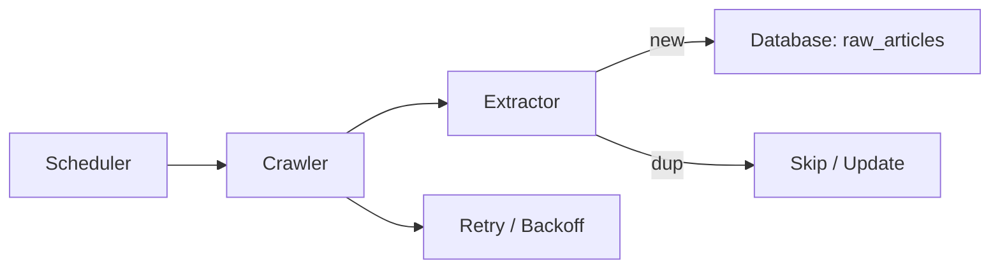
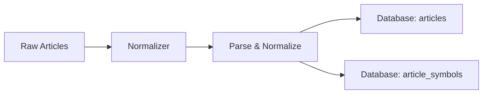
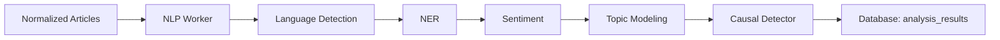
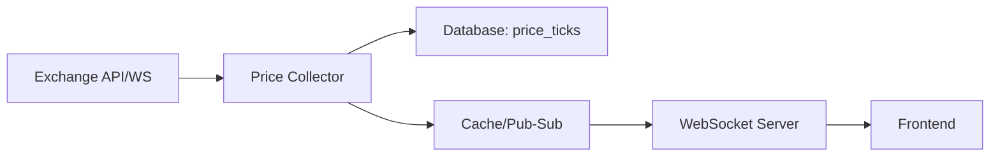
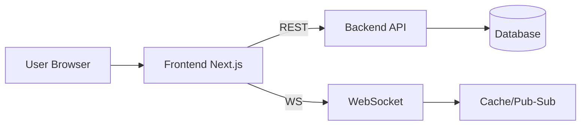
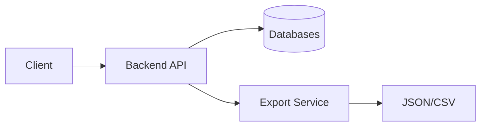

# Features and Functional Flows

This document describes the core features of the Trading Platform, their functional flows, and acceptance criteria. Features are aligned with [CoreRequirements.md](./CoreRequirements.md).

> **Note**: For administration and monitoring features, see [Operations.md](./Operations.md).

---

## Table of Contents

1. [News Ingestion (Crawler)](#1-news-ingestion-crawler)
2. [Normalization & Storage](#2-normalization--storage)
3. [AI Analysis (NLP)](#3-ai-analysis-nlp)
4. [Price Collection & Charting](#4-price-collection--charting)
5. [Aggregation (Candle Generation)](#5-aggregation-candle-generation)
6. [UI Dashboard (Frontend)](#6-ui-dashboard-frontend)
7. [API Access](#7-api-access)

---

## 1) News Ingestion (Crawler)

**Requirement**: Financial News Collection (from multiple sources) - Crawler

### Description
Automatically collect articles from multiple news sources and store raw HTML with metadata. The system learns each site's HTML structure and adapts to changes.

### Functional Flow
1. Scheduler triggers crawl jobs based on configured intervals
2. Crawler fetches pages (HTTP client or headless Selenium for JS-rendered content)
3. Extractor uses adaptive selectors/heuristics to extract:
   - Title, body text, publish date
   - Authors, tags, referenced symbols
4. Store raw payload in database
5. Publish event for downstream processing

### Acceptance Criteria
- [ ] Dedupe by URL/hash to avoid duplicates
- [ ] Retry on failure with exponential backoff
- [ ] Crawl success rate >= 90% per source
- [ ] Handle HTML structure changes gracefully

### Flow Diagram

---

## 2) Normalization & Storage

**Requirement**: Store data comprehensively and display selectively on GUI

### Description
Normalize article content into a common schema for consistent processing and display.

### Functional Flow
1. Normalizer reads raw articles
2. Parse HTML and extract structured fields:
   - Title, body, published_at
   - Symbols mentioned, source metadata
3. Normalize date formats and metadata
4. Store normalized documents in database

### Acceptance Criteria
- [ ] Text extraction accuracy >= 95% for supported sources
- [ ] No missing body content
- [ ] Consistent date format (ISO 8601)
- [ ] Symbol extraction from text

### Flow Diagram

---

## 3) AI Analysis (NLP)

**Requirement**: AI Models for News Analysis

### Description
Run NLP pipelines to compute sentiment, entities, topics, and causal signals for trend prediction.

### Functional Flow
1. NLP worker processes normalized articles
2. Pipeline stages:
   - Language detection
   - Named Entity Recognition (NER)
   - Sentiment analysis (bullish/bearish/neutral)
   - Topic modeling
   - Causal signal detection
3. Persist results for querying
4. Generate trend predictions with reasoning

### Modes
- **Near-realtime**: Process articles as they arrive
- **Batch reprocessing**: Reanalyze historical articles with updated models

### Acceptance Criteria
- [ ] Sentiment baseline accuracy > 70%
- [ ] Processing latency < 5s per article
- [ ] Trend prediction with explanation text
- [ ] Support model switching

### Flow Diagram

---

## 4) Price Collection & Charting

**Requirement**: Price Chart Display (similar to TradingView), Binance Exchange

### Description
Collect historical and real-time price data for charting and analysis. Display similar to TradingView with WebSocket updates.

### Functional Flow
1. Price Collector subscribes to exchange API/WebSocket feeds
2. Ingest ticks and store in time-series database
3. Publish updates for real-time delivery to clients
4. Support multiple currency pairs (BTCUSDT, ETHUSDT, etc.)

### Acceptance Criteria
- [ ] Support multiple timeframes (1m, 5m, 15m, 1h, 4h, 1d)
- [ ] Real-time tick latency < 1s
- [ ] Historical data retrieval < 200ms
- [ ] Multiple currency pair support

### Flow Diagram

---

## 5) Aggregation (Candle Generation)

**Requirement**: Support multiple timeframes

### Description
Aggregate ticks into OHLCV candles for multiple intervals.

### Functional Flow
1. Aggregator reads price ticks
2. Compute candles per configured interval:
   - Open, High, Low, Close, Volume
3. Persist candles to database
4. Update cache for recent candles
5. Notify WebSocket server for client updates

### Acceptance Criteria
- [ ] Candle generation latency < 2s after interval close
- [ ] Support intervals: 1m, 5m, 15m, 30m, 1h, 4h, 1d
- [ ] Handle gap detection (missing ticks)

### Flow Diagram

---

## 6) UI Dashboard (Frontend)

**Requirement**: GUI for chart display and news browsing

### Description
Dashboard for browsing news, viewing interactive charts, and receiving real-time updates.

### Functional Flow
1. User loads dashboard → frontend fetches overview via REST API
2. User opens a chart → frontend:
   - Requests historical candles via `/api/prices/historical`
   - Subscribes to WebSocket channel for real-time ticks
3. User clicks an article → frontend displays details with symbol/time context
4. Real-time updates push to connected clients

### Pages
| Page | Description |
|------|-------------|
| Dashboard | Overview with key metrics, recent news |
| Chart | TradingView-style interactive chart |
| News Feed | Article list with filters and search |
| Article Detail | Full article with sentiment, related symbols |

### Acceptance Criteria
- [ ] Chart loads in < 2s
- [ ] WebSocket reconnection on disconnect
- [ ] Responsive design (desktop + mobile)
- [ ] Article-chart context linking

### Flow Diagram

---

## 7) API Access

**Requirement**: Provide data access for analysis and export

### Description
RESTful API endpoints for data access with export options.

### Endpoints

| Endpoint | Method | Description |
|----------|--------|-------------|
| `/api/articles` | GET | List articles with filters |
| `/api/articles/{id}` | GET | Article details with analysis |
| `/api/prices/historical` | GET | Historical candles |
| `/api/prices/symbols` | GET | Available trading pairs |
| `/api/analysis/{articleId}` | GET | NLP analysis results |
| `/ws/prices` | WS | Real-time price updates |

### Query Parameters
- `symbol`: Filter by trading pair
- `timeframe`: Candle interval
- `from`, `to`: Date range
- `limit`, `offset`: Pagination

### Export Formats
- JSON (default)
- CSV (for data analysis)

### Acceptance Criteria
- [ ] API response time < 200ms (p95)
- [ ] Pagination for large result sets
- [ ] Consistent error response format

### Flow Diagram

---

## Feature-Architecture Phase Mapping

| Feature | Phase 1 | Phase 2 | Phase 3 | Phase 4 | Phase 5 |
|---------|---------|---------|---------|---------|---------|
| Crawler | Basic | + MongoDB | + API Gateway | + Kafka | Full |
| Normalizer | Inline | Inline | Module | Consumer | Service |
| NLP | Basic | + Cache | + External API | Consumer | Service |
| Price Collector | Basic | + Redis | + WebSocket | + Kafka | Service |
| Aggregator | Inline | Inline | Module | Consumer | Service |
| Frontend | Basic | + Charts | + Real-time | Full | Full |
| API | REST | + Cache | + Gateway | Full | Full |

---

## References

- [CoreRequirements.md](./CoreRequirements.md) - Business requirements
- [Architecture.md](./Architecture.md) - Technical architecture
- [ProjectPlan.md](./ProjectPlan.md) - Implementation timeline
- [UseCaseDiagram.md](./UseCaseDiagram.md) - User interactions

