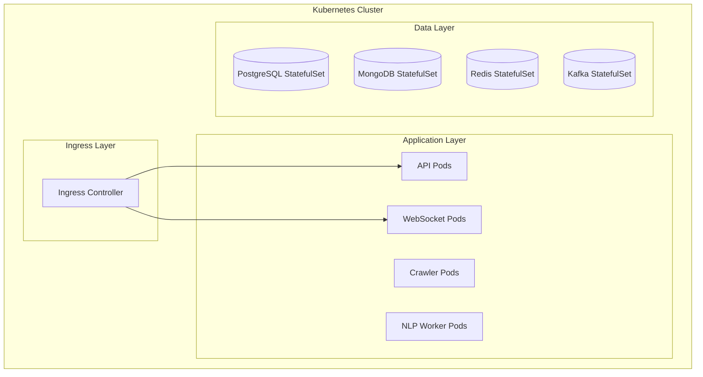

# Operations Guide

This document covers operational concerns that can be integrated into the project during later stages when the system grows complex and requires advanced monitoring, security, orchestration, and continuous integration/deployment capabilities.

> **Note**: These operational components are designed to be seamlessly integrated into the architecture but are not coupled with core business logic. They should be incorporated during Phase 5-6 (see ProjectPlan.md) when the system scales beyond 10,000 concurrent users.

---

## Table of Contents

1. [Monitoring & Observability](#monitoring--observability)
2. [Security](#security)
3. [Kubernetes Orchestration](#kubernetes-orchestration)
4. [CI/CD Pipeline](#cicd-pipeline)
5. [Integration Points](#integration-points)

---

## Monitoring & Observability

### Rationale

When the system scales to handle 10,000+ concurrent users with multiple microservices, monitoring becomes essential for:
- Identifying performance bottlenecks
- Tracking system health and availability
- Debugging distributed system issues
- Capacity planning and cost optimization

### Recommended Stack

| Component | Tool | Purpose |
|-----------|------|---------|
| Metrics | Prometheus | Time-series metrics collection |
| Visualization | Grafana | Dashboards and alerting |
| Logging | ELK/EFK Stack | Centralized log aggregation |
| Tracing | Zipkin/Jaeger | Distributed request tracing |

### Metrics to Monitor

**Application Metrics:**
- API response times (p50, p95, p99)
- Request throughput (requests/second)
- Error rates by endpoint
- Active WebSocket connections
- Message queue depth (Kafka consumer lag)

**Infrastructure Metrics:**
- CPU/Memory utilization per service
- Database connection pool usage
- Redis cache hit/miss ratio
- Disk I/O and network throughput

**Business Metrics:**
- Articles crawled per hour
- Price ticks processed per second
- NLP analysis queue depth
- Active user sessions

### Implementation Guide

```yaml
# docker-compose.monitoring.yml
services:
  prometheus:
    image: prom/prometheus:latest
    ports:
      - "9090:9090"
    volumes:
      - ./prometheus.yml:/etc/prometheus/prometheus.yml

  grafana:
    image: grafana/grafana:latest
    ports:
      - "3001:3000"
    environment:
      - GF_SECURITY_ADMIN_PASSWORD=admin
    depends_on:
      - prometheus
```

### Spring Boot Integration

Add to `pom.xml`:
```xml
<dependency>
    <groupId>io.micrometer</groupId>
    <artifactId>micrometer-registry-prometheus</artifactId>
</dependency>
<dependency>
    <groupId>org.springframework.boot</groupId>
    <artifactId>spring-boot-starter-actuator</artifactId>
</dependency>
```

Configure in `application.yml`:
```yaml
management:
  endpoints:
    web:
      exposure:
        include: health,info,prometheus,metrics
  metrics:
    export:
      prometheus:
        enabled: true
```

---

## Security

### Rationale

Security measures should be implemented progressively:
- **Phase 3-4**: Basic authentication and authorization
- **Phase 5+**: Advanced security for production environments

### Authentication & Authorization

**JWT-based Authentication:**
```java
// Example JWT configuration
@Configuration
@EnableWebSecurity
public class SecurityConfig {
    // Implement after core features are stable
}
```

**Role-based Access Control (RBAC):**
- `ROLE_TRADER`: View charts, read articles
- `ROLE_ANALYST`: Run NLP queries, export reports
- `ROLE_ADMIN`: Manage sources, users, system configuration

### API Security

| Measure | Implementation | Phase |
|---------|---------------|-------|
| HTTPS/TLS | Nginx reverse proxy | Phase 4 |
| Rate Limiting | API Gateway (Spring Cloud Gateway) | Phase 5 |
| Input Validation | Bean Validation (JSR-380) | Phase 2 |
| CORS | Spring Security CORS config | Phase 2 |
| SQL Injection Prevention | JPA/Hibernate parameterized queries | Phase 1 |

### Secrets Management

For production deployments:
- Use environment variables for sensitive configuration
- Consider HashiCorp Vault for secrets management
- Never commit secrets to version control

```yaml
# Example: .env.example (template for local development)
DB_PASSWORD=your_password_here
JWT_SECRET=your_jwt_secret_here
EXCHANGE_API_KEY=your_api_key_here
```

---

## Kubernetes Orchestration

### Rationale

Kubernetes becomes beneficial when:
- Managing 5+ microservices
- Requiring auto-scaling for variable load (10,000+ users)
- Needing zero-downtime deployments
- Operating across multiple availability zones

### Architecture Overview



### Deployment Manifests

```yaml
# k8s/api-deployment.yaml
apiVersion: apps/v1
kind: Deployment
metadata:
  name: backend-api
spec:
  replicas: 3
  selector:
    matchLabels:
      app: backend-api
  template:
    metadata:
      labels:
        app: backend-api
    spec:
      containers:
      - name: api
        image: trading-platform/api:latest
        ports:
        - containerPort: 8080
        resources:
          requests:
            memory: "512Mi"
            cpu: "250m"
          limits:
            memory: "1Gi"
            cpu: "500m"
```

### Horizontal Pod Autoscaling

```yaml
# k8s/api-hpa.yaml
apiVersion: autoscaling/v2
kind: HorizontalPodAutoscaler
metadata:
  name: backend-api-hpa
spec:
  scaleTargetRef:
    apiVersion: apps/v1
    kind: Deployment
    name: backend-api
  minReplicas: 2
  maxReplicas: 10
  metrics:
  - type: Resource
    resource:
      name: cpu
      target:
        type: Utilization
        averageUtilization: 70
```

---

## CI/CD Pipeline

### Rationale

Implement CI/CD when:
- Multiple developers contributing simultaneously
- Frequent releases required
- Quality gates needed before deployment

### GitHub Actions Workflow

```yaml
# .github/workflows/ci.yml
name: CI Pipeline

on:
  push:
    branches: [main, develop]
  pull_request:
    branches: [main]

jobs:
  build:
    runs-on: ubuntu-latest
    steps:
    - uses: actions/checkout@v4
    
    - name: Set up JDK 17
      uses: actions/setup-java@v4
      with:
        java-version: '17'
        distribution: 'temurin'
        cache: maven
    
    - name: Build with Maven
      run: mvn -B package --file pom.xml
    
    - name: Run tests
      run: mvn test
    
    - name: Build Docker image
      run: docker build -t trading-platform/api:${{ github.sha }} .

  deploy:
    needs: build
    if: github.ref == 'refs/heads/main'
    runs-on: ubuntu-latest
    steps:
    - name: Deploy to staging
      run: echo "Deploy to staging environment"
```

### Deployment Stages

| Stage | Trigger | Environment | Tests |
|-------|---------|-------------|-------|
| Build | Every push | CI | Unit tests |
| Integration | PR merge | Staging | Integration tests |
| Performance | Release candidate | Staging | Load tests |
| Production | Manual approval | Production | Smoke tests |

---

## Integration Points

### How to Integrate with Core Architecture

The operational components are designed to integrate with the core system through:

1. **Docker Compose Overrides**: Use `docker-compose.override.yml` for local monitoring
2. **Environment Profiles**: Spring Boot profiles for different environments
3. **Sidecar Pattern**: Monitoring agents alongside application containers
4. **Service Mesh**: Optional Istio/Linkerd for advanced traffic management

### Recommended Integration Timeline

| Phase | Components to Integrate | User Scale |
|-------|------------------------|------------|
| Phase 4 | Basic health endpoints, HTTPS | 100-1,000 |
| Phase 5 | Full monitoring stack, CI/CD | 1,000-10,000 |
| Phase 6 | Kubernetes, auto-scaling | 10,000-100,000 |
| Phase 6+ | Service mesh, advanced security | 100,000-1,000,000 |

### Configuration Files to Add

When integrating, add these files to the project:

```
├── docker/
│   ├── docker-compose.monitoring.yml
│   └── prometheus.yml
├── k8s/
│   ├── deployment.yaml
│   ├── service.yaml
│   ├── ingress.yaml
│   └── hpa.yaml
├── .github/
│   └── workflows/
│       ├── ci.yml
│       └── cd.yml
└── config/
    └── security/
        └── SecurityConfig.java
```

---

## References

- [Spring Boot Actuator Documentation](https://docs.spring.io/spring-boot/docs/current/reference/html/actuator.html)
- [Prometheus Documentation](https://prometheus.io/docs/)
- [Kubernetes Documentation](https://kubernetes.io/docs/)
- [GitHub Actions Documentation](https://docs.github.com/en/actions)
