# Use Case Diagram

This file contains the system use-case diagram for the project (Mermaid) and a short mapping that links each use case to the responsible system component(s).

The diagram is based on the features and architecture described across the `Document/` folder (crawler, normalizer, NLP analysis, price collection, aggregation, backend API, frontend, admin, monitoring).

```mermaid
%%{init: {'theme': 'base', 'themeVariables': { 'primaryColor': '#f4f4f8', 'edgeLabelBackground':'#ffffff'} }}%%
graph TB
    subgraph Actors
        T[Trader]
        A[Analyst]
        Admin[Administrator]
        ES[External System]
        Sch[Scheduler]
    end
    
    subgraph "User Operations"
        UC1[View Dashboard]
        UC2[View Price Chart]
        UC3[Search & Read Articles]
        UC4[Subscribe Realtime<br/>Price Feed]
        UC5[Request Historical<br/>Candles]
    end
    
    subgraph "Analysis Operations"
        UC6[Run Ad-hoc<br/>NLP Query]
        UC7[Export Analysis<br/>Report]
    end
    
    subgraph "Admin Operations"
        UC8[Manage Sources]
        UC9[Manage Users<br/>& Roles]
        UC10[Monitor System<br/>Health]
        UC11[Configure Crawling<br/>Schedule]
    end
    
    subgraph "System Operations"
        UC12[Push External<br/>Price Feed]
        UC13[Consume REST API]
        UC14[Start Crawling Job]
        UC15[Start Price<br/>Collection Job]
    end
    
    T --> UC1
    T --> UC2
    T --> UC3
    T --> UC4
    T --> UC5
    
    A --> UC6
    A --> UC7
    
    Admin --> UC8
    Admin --> UC9
    Admin --> UC10
    Admin --> UC11
    
    ES --> UC12
    ES --> UC13
    
    Sch --> UC14
    Sch --> UC15
    
    style UC1 fill:#e3f2fd
    style UC2 fill:#e3f2fd
    style UC3 fill:#e3f2fd
    style UC4 fill:#e3f2fd
    style UC5 fill:#e3f2fd
    style UC6 fill:#fff3e0
    style UC7 fill:#fff3e0
    style UC8 fill:#f3e5f5
    style UC9 fill:#f3e5f5
    style UC10 fill:#f3e5f5
    style UC11 fill:#f3e5f5
    style UC12 fill:#e8f5e9
    style UC13 fill:#e8f5e9
    style UC14 fill:#e8f5e9
    style UC15 fill:#e8f5e9
```

**Diagram Notes:**

- **Crawler**: UC14 fetches articles and enqueues messages

- **Price Collector**: UC15 collects tick data and stores time-series
- **NLP Worker**: UC6 performs entity extraction, topic modeling, and sentiment analysis
- **Backend API + Aggregator**: UC1 aggregates metrics and provides REST/WebSocket interfaces

## Use case -> Component mapping

- View Dashboard: Backend API (Aggregator), Frontend UI, Redis pub/sub (realtime)

- View Price Chart: Backend API, Time-series DB (Postgres + Timescale), Price Collector
- Search & Read Articles: Backend API (search index), MongoDB (raw articles), Normalizer
- Subscribe Realtime Price Feed: Backend API (WebSocket), Redis pub/sub, Price Collector
- Request Historical Candles: Backend API, Aggregator, Time-series DB
- Run Ad-hoc NLP Query: NLP Worker, MongoDB (NLP results), Search/Index service
- Export Analysis Report: Backend API, Storage (S3 or file store)
- Manage Sources: Admin UI -> Backend API -> Crawler config store
- Manage Users & Roles: Backend API (auth), User DB
- Monitor System Health: Admin UI -> Metrics exporter, Prometheus/Grafana
- Configure Crawling Schedule: Admin UI -> Scheduler -> Crawler
- Push External Price Feed: ExternalSystem -> Price Collector -> Time-series DB
- Consume REST API: ExternalSystem -> Backend API

## Notes

- Actors are represented at a business/operational level (Trader, Analyst, Admin, External systems, Scheduler). Implementation components are shown in the mapping section.

