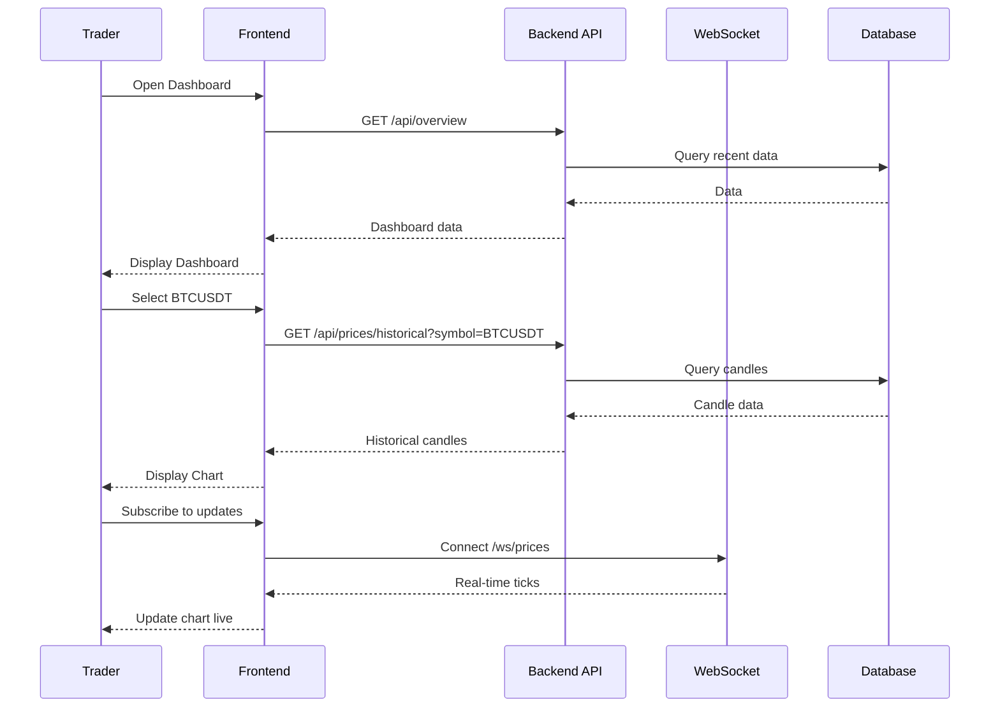
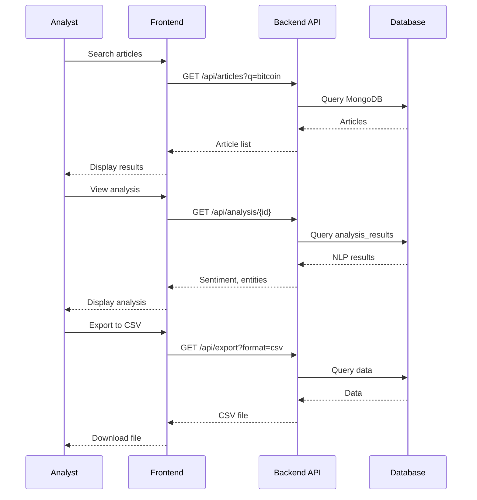

# Use Case Diagram

This document contains the system use-case diagram and maps each use case to responsible system components.

> **Note**: For admin and monitoring use cases, see [Operations.md](./Operations.md).

---

## System Use Cases

```mermaid
%%{init: {'theme': 'base', 'themeVariables': { 'primaryColor': '#f4f4f8', 'edgeLabelBackground':'#ffffff'} }}%%
graph TB
    subgraph Actors
        T[Trader]
        A[Analyst]
        Sch[Scheduler]
    end
    
    subgraph "Core User Operations"
        UC1[View Dashboard]
        UC2[View Price Chart]
        UC3[Search & Read Articles]
        UC4[Subscribe Real-time<br/>Price Feed]
        UC5[Request Historical<br/>Candles]
        UC6[Select Currency Pair]
    end
    
    subgraph "Analysis Operations"
        UC7[View Sentiment<br/>Analysis]
        UC8[View Trend<br/>Prediction]
        UC9[Export Data<br/>CSV/JSON]
    end
    
    subgraph "System Operations"
        UC10[Start Crawling Job]
        UC11[Start Price<br/>Collection Job]
        UC12[Process NLP<br/>Analysis]
        UC13[Generate Candles]
    end
    
    T --> UC1
    T --> UC2
    T --> UC3
    T --> UC4
    T --> UC5
    T --> UC6
    
    A --> UC7
    A --> UC8
    A --> UC9
    
    Sch --> UC10
    Sch --> UC11
    Sch --> UC12
    Sch --> UC13
    
    style UC1 fill:#e3f2fd
    style UC2 fill:#e3f2fd
    style UC3 fill:#e3f2fd
    style UC4 fill:#e3f2fd
    style UC5 fill:#e3f2fd
    style UC6 fill:#e3f2fd
    style UC7 fill:#fff3e0
    style UC8 fill:#fff3e0
    style UC9 fill:#fff3e0
    style UC10 fill:#e8f5e9
    style UC11 fill:#e8f5e9
    style UC12 fill:#e8f5e9
    style UC13 fill:#e8f5e9
```

---

## Actor Descriptions

| Actor | Description |
|-------|-------------|
| **Trader** | Primary user who views charts, reads news, and monitors prices |
| **Analyst** | User who performs deeper analysis and exports data |
| **Scheduler** | System component that triggers automated jobs |

---

## Use Case Details

### Core User Operations

| Use Case | Description | Primary Actor |
|----------|-------------|---------------|
| View Dashboard | Access overview with key metrics and recent news | Trader |
| View Price Chart | Display TradingView-style interactive chart | Trader |
| Search & Read Articles | Browse and filter news articles | Trader |
| Subscribe Real-time Price Feed | Receive WebSocket updates for live prices | Trader |
| Request Historical Candles | Fetch OHLCV data for charting | Trader |
| Select Currency Pair | Choose trading pair (BTCUSDT, etc.) | Trader |

### Analysis Operations

| Use Case | Description | Primary Actor |
|----------|-------------|---------------|
| View Sentiment Analysis | See bullish/bearish indicators on articles | Analyst |
| View Trend Prediction | Access AI predictions with reasoning | Analyst |
| Export Data CSV/JSON | Download data for external analysis | Analyst |

### System Operations

| Use Case | Description | Trigger |
|----------|-------------|---------|
| Start Crawling Job | Fetch articles from configured sources | Scheduled |
| Start Price Collection Job | Connect to exchange and ingest ticks | Scheduled |
| Process NLP Analysis | Run sentiment and entity extraction | Event-driven |
| Generate Candles | Aggregate ticks into OHLCV candles | Event-driven |

---

## Use Case → Component Mapping

| Use Case | Components |
|----------|------------|
| View Dashboard | Frontend → Backend API → Databases |
| View Price Chart | Frontend → Backend API → PostgreSQL, WebSocket → Redis |
| Search & Read Articles | Frontend → Backend API → MongoDB |
| Subscribe Real-time Price Feed | Frontend → WebSocket → Redis Pub/Sub → Price Collector |
| Request Historical Candles | Frontend → Backend API → PostgreSQL |
| Select Currency Pair | Frontend → Backend API → Price Collector config |
| View Sentiment Analysis | Frontend → Backend API → MongoDB (analysis_results) |
| View Trend Prediction | Frontend → Backend API → NLP Worker → MongoDB |
| Export Data CSV/JSON | Frontend → Backend API → Export Service |
| Start Crawling Job | Scheduler → Crawler → Database/Message Queue |
| Start Price Collection Job | Scheduler → Price Collector → Database/Message Queue |
| Process NLP Analysis | Message Queue → NLP Worker → MongoDB |
| Generate Candles | Message Queue → Aggregator → PostgreSQL |

---

## User Journeys

### Trader: Monitor Market

### Analyst: Export Analysis

---

## Phase Implementation

| Use Case | Phase 1 | Phase 2 | Phase 3 | Phase 4 | Phase 5 |
|----------|---------|---------|---------|---------|---------|
| View Dashboard | Basic | + Cache | Full | Full | Full |
| View Price Chart | Basic | + WebSocket | + Gateway | Full | Full |
| Search & Read Articles | Basic | + MongoDB | Full | Full | Full |
| Real-time Price Feed | Polling | WebSocket | + Redis | Kafka | Full |
| Historical Candles | Basic | + Cache | Full | Full | Full |
| Sentiment Analysis | - | Basic | + External API | Full | Full |
| Trend Prediction | - | - | Basic | + Kafka | Full |
| Export Data | Basic | Full | Full | Full | Full |
| Crawling Job | @Scheduled | @Scheduled | Module | Kafka | Service |
| Price Collection | Basic | + Redis | + Gateway | Kafka | Service |
| NLP Analysis | - | Basic | Module | Consumer | Service |
| Candle Generation | Inline | Inline | Module | Consumer | Service |

---

## References

- [CoreRequirements.md](./CoreRequirements.md) - Business requirements
- [Features.md](./Features.md) - Feature specifications
- [Architecture.md](./Architecture.md) - Technical architecture
- [ProjectPlan.md](./ProjectPlan.md) - Implementation timeline

