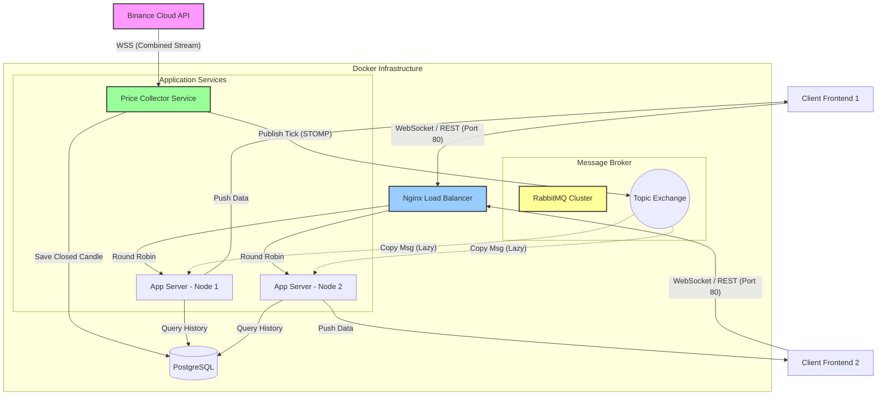

---

# Real-time Trading System Architecture Documentation

## 1. Tổng quan (Overview)

Hệ thống được thiết kế để cung cấp dữ liệu giá tiền mã hóa (Cryptocurrency) theo thời gian thực (Real-time) từ Binance đến người dùng cuối với độ trễ thấp nhất. Hệ thống sử dụng kiến trúc hướng sự kiện (Event-Driven Architecture) kết hợp với mô hình Microservices-ready (Monolith Scaling), cho phép mở rộng (scale) số lượng người dùng đồng thời mà không ảnh hưởng đến hiệu năng thu thập dữ liệu.

### Các đặc điểm chính:

* **High Scalability:** Tách biệt luồng thu thập dữ liệu (Collector) và luồng phục vụ người dùng (Gateway).
* **Low Latency:** Sử dụng WebSocket (STOMP) và Message Broker (RabbitMQ) để truyền tải dữ liệu.
* **Reliability:** Cơ chế tự động kết nối lại (Auto-reconnect) và đảm bảo tính toàn vẹn dữ liệu.

## 2. Sơ đồ kiến trúc (Architecture Diagram)

Dưới đây là sơ đồ luồng dữ liệu và các thành phần trong hệ thống:



## 3. Các thành phần hệ thống (System Components)

### 3.1. Nginx Load Balancer

* **Vai trò:** Cổng vào duy nhất của hệ thống (Reverse Proxy).
* **Chức năng:**
* Tiếp nhận request HTTP và WebSocket từ Client.
* Điều phối tải (Load balancing) tới các App Server Instance (Round Robin).
* Xử lý `Upgrade Headers` để hỗ trợ giao thức WebSocket.


* **Cấu hình:** Listen port 9000 (hoặc 80), proxy_pass vào mạng nội bộ Docker.

### 3.2. Application Servers (Gateway Nodes)

* **Profile:** `user` (hoặc `default`).
* **Số lượng:** N bản (Replica set), có thể scale horizontal.
* **Vai trò:** Phục vụ người dùng cuối.
* **Chức năng:**
* **REST API:** Cung cấp API lấy lịch sử nến, thông tin tài khoản (truy vấn DB).
* **WebSocket Broker Relay:** Sử dụng `Spring Stomp Broker Relay`. Không xử lý logic nến, chỉ đóng vai trò "cầu nối" (Proxy) nhận dữ liệu từ RabbitMQ và đẩy xuống socket của User đang kết nối tới node đó.
* **Lazy Subscription:** Chỉ mở kết nối nhận tin từ RabbitMQ khi có User thực sự subscribe topic đó.


### 3.3. Price Collector Service

* **Profile:** `collector`.
* **Số lượng:** 1 bản duy nhất (Singleton Worker).
* **Vai trò:** Worker thu thập và xử lý dữ liệu thô.
* **Chức năng:**
* Kết nối **Binance WebSocket Combined Streams** (lấy nhiều cặp coin/khung giờ cùng lúc).
* **Publisher:** Bắn dữ liệu tick real-time vào RabbitMQ Topic Exchange (`amq.topic`).
* **Persistence:** Kiểm tra trạng thái nến. Nếu nến đóng (`x: true`), thực hiện lưu vào PostgreSQL.


### 3.4. RabbitMQ (Message Broker)

* **Vai trò:** Trái tim của hệ thống real-time, trung chuyển dữ liệu.
* **Cấu hình:**
* Plugin: `rabbitmq_stomp` (Port 61613).
* Exchange Type: `Topic Exchange` (cho phép routing linh hoạt theo key `candles.*.*`).


* **Cơ chế:** Fan-out dữ liệu từ Collector tới tất cả các App Server đang có active subscribers.

### 3.5. PostgreSQL (Database)

* **Vai trò:** Lưu trữ dữ liệu bền vững.
* **Dữ liệu:** Lưu trữ lịch sử nến (OHLCV) để phục vụ việc vẽ chart ban đầu (khi user mới vào chưa có data realtime).

## 4. Luồng dữ liệu (Data Flow)

### 4.1. Luồng Real-time (Hot Path)

1. **Binance** gửi gói tin tick giá qua WebSocket tới **Price Collector**.
2. **Price Collector** chuẩn hóa dữ liệu thành DTO, gắn Routing Key (ví dụ: `topic.candles.1m.btcusdt`).
3. **Price Collector** bắn tin nhắn vào **RabbitMQ Exchange**.
4. **RabbitMQ** kiểm tra xem Server Node nào đang đăng ký lắng nghe topic này.
5. **RabbitMQ** copy tin nhắn và đẩy vào Queue tạm của các **Server Node** tương ứng.
6. **Server Node** nhận tin nhắn qua giao thức STOMP và đẩy ngay lập tức xuống **Client (Frontend)** qua WebSocket.

### 4.2. Luồng Lịch sử (Cold Path)

1. **Client** tải trang, gọi REST API `/api/candles?symbol=BTC&limit=100`.
2. Request đi qua **Nginx** -> **App Server Node** bất kỳ.
3. **App Server** truy vấn **PostgreSQL** lấy 100 cây nến gần nhất.
4. Trả về JSON cho Client để vẽ biểu đồ ban đầu.

## 5. Công nghệ sử dụng (Technology Stack)

| Thành phần | Công nghệ | Phiên bản | Ghi chú |
| --- | --- | --- | --- |
| **Backend Framework** | Spring Boot | 3.x | Java 17/21 |
| **Protocol** | WebSocket | STOMP | SockJS Fallback |
| **Message Broker** | RabbitMQ | 3-Management | STOMP Plugin Enabled |
| **Database** | PostgreSQL | 15+ | JPA / Hibernate |
| **Load Balancer** | Nginx | Alpine |  |
| **Deployment** | Docker & Compose | v3.8 | Multi-stage build |

## 6. Chiến lược mở rộng (Scalability Strategy)

Hệ thống được thiết kế để tách biệt (Decoupled):

* **Khi lượng User tăng đột biến:** Chỉ cần tăng số lượng Replica của service `trading-backend` trong Docker Compose (hoặc Kubernetes). RabbitMQ sẽ tự động phân phối tin nhắn đến các node mới. Service `collector` không bị ảnh hưởng.
* **Khi muốn thêm cặp Coin mới:** Chỉ cần cấu hình lại `Price Collector` để subscribe thêm stream từ Binance. Hạ tầng phục vụ user không cần thay đổi.

## 7. Cấu hình triển khai (Deployment Configuration)

### Docker Compose Services

* `load-balancer`: Port host `9000` -> Container `80`.
* `trading-backend`: Replicas `3`. Port container `8080`. Profile `user`.
* `price-collector`: Replicas `1`. Profile `collector`.
* `rabbitmq`: Ports `5672` (AMQP), `15672` (UI), `61613` (STOMP).
* `postgres`: Port `5432`.

### Environment Variables Key

```properties
# Backend Nodes
SPRING_PROFILES_ACTIVE=user
SPRING_RABBITMQ_HOST=rabbitmq
SPRING_RABBITMQ_PORT=5672
SPRING_RABBITMQ_STOMP_PORT=61613

# Collector Node
SPRING_PROFILES_ACTIVE=collector
BINANCE_WS_URL=wss://stream.binance.com:9443/stream?streams=
PRICE_SYMBOLS=btcusdt,ethusdt,bnbusdt

```