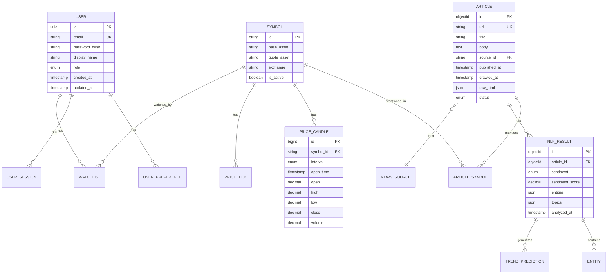

# Database Design Document

**Trading Platform - Comprehensive Database Architecture**

---

## Table of Contents

1. [Overview](#overview)
2. [Database Strategy by Phase](#database-strategy-by-phase)
3. [Entity Relationship Diagram](#entity-relationship-diagram)
4. [PostgreSQL Schema](#postgresql-schema)
5. [MongoDB Collections](#mongodb-collections)
6. [Redis Data Structures](#redis-data-structures)
7. [Indexing Strategy](#indexing-strategy)
8. [Data Migration Patterns](#data-migration-patterns)
9. [Data Retention & Archiving](#data-retention--archiving)
10. [Performance Optimization](#performance-optimization)
11. [Backup & Recovery](#backup--recovery)
12. [References](#references)

---

## Overview

### Purpose

This document defines the comprehensive database architecture for the Trading Platform, supporting:

1. **Financial News Collection** - Store raw and processed articles from multiple sources
2. **Price Chart Data** - Real-time and historical price data for cryptocurrency pairs
3. **AI/NLP Analysis Results** - Sentiment analysis, entity extraction, trend predictions
4. **Account Management** - User authentication, preferences, and sessions

### Design Principles

| Principle | Description |
|-----------|-------------|
| **Evolutionary Architecture** | Database design scales from Phase 1 (single PostgreSQL) to Phase 6 (polyglot persistence) |
| **Separation of Concerns** | Different data stores optimized for specific access patterns |
| **Data Integrity** | ACID compliance for critical transactions, eventual consistency where appropriate |
| **Performance** | Optimized indexes, caching strategies, and query patterns |
| **Scalability** | Horizontal scaling through partitioning, sharding, and replication |

### Technology Stack

| Database | Version | Purpose | Phase Introduced |
|----------|---------|---------|------------------|
| **PostgreSQL** | 15+ | Structured data, time-series prices, user data | Phase 1 |
| **MongoDB** | 7.0+ | Articles, NLP results, flexible schemas | Phase 2 |
| **Redis** | 7.0+ | Caching, sessions, real-time pub/sub | Phase 2 |
| **TimescaleDB** | 2.x | Optimized time-series queries (extension) | Phase 5 |
| **Elasticsearch** | 8.x | Full-text search, article indexing | Phase 6 |

---

## Database Strategy by Phase

### Phase 1: Monolithic Foundation (1-10 users)

```
┌─────────────────────────────────────────────────────┐
│                    PostgreSQL                        │
│  ┌─────────────┐ ┌─────────────┐ ┌───────────────┐  │
│  │   articles  │ │price_candles│ │    users      │  │
│  │   (JSONB)   │ │             │ │               │  │
│  └─────────────┘ └─────────────┘ └───────────────┘  │
└─────────────────────────────────────────────────────┘
```

**Rationale**: Single database simplifies development and debugging. PostgreSQL's JSONB handles semi-structured article data.

### Phase 2: Database Optimization (10-1,000 users)

```
┌──────────────┐    ┌──────────────┐    ┌──────────────┐
│  PostgreSQL  │    │   MongoDB    │    │    Redis     │
│  - Users     │    │  - Articles  │    │  - Sessions  │
│  - Prices    │    │  - NLP       │    │  - Cache     │
│  - Candles   │    │  - Raw HTML  │    │  - Pub/Sub   │
└──────────────┘    └──────────────┘    └──────────────┘
```

**Rationale**: Specialized databases improve performance for specific workloads.

### Phase 3-4: Service Separation (100-10,000 users)

Same databases with:
- Connection pooling (HikariCP)
- Read replicas for PostgreSQL
- Redis clustering for cache
- Kafka for event streaming

### Phase 5-6: Microservices & CQRS (10,000+ users)

```
┌──────────────┐    ┌──────────────┐    ┌──────────────┐
│  PostgreSQL  │    │   MongoDB    │    │    Redis     │
│  + Timescale │    │  + Sharding  │    │  + Cluster   │
└──────────────┘    └──────────────┘    └──────────────┘
        │                  │                   │
        └──────────────────┼───────────────────┘
                           │
                  ┌────────┴────────┐
                  │  Elasticsearch  │
                  │  (Full-text)    │
                  └─────────────────┘
```

---

## Entity Relationship Diagram

### Core Domain Model



### Detailed Entity Descriptions

| Entity | Storage | Description |
|--------|---------|-------------|
| USER | PostgreSQL | User accounts with authentication data |
| USER_PREFERENCE | PostgreSQL | User settings (theme, default symbol, etc.) |
| USER_SESSION | Redis | Active sessions with JWT tokens |
| ARTICLE | MongoDB | News articles with raw and processed content |
| NEWS_SOURCE | MongoDB | Configured news sources with selectors |
| ARTICLE_SYMBOL | MongoDB | Many-to-many: articles mentioning symbols |
| SYMBOL | PostgreSQL | Trading pairs (BTCUSDT, ETHUSDT, etc.) |
| PRICE_TICK | PostgreSQL/Kafka | Raw price ticks from exchange |
| PRICE_CANDLE | PostgreSQL | Aggregated OHLCV candles |
| NLP_RESULT | MongoDB | Sentiment, entities, topics per article |
| TREND_PREDICTION | MongoDB | AI-generated trend predictions |

---

## PostgreSQL Schema

### Users & Authentication

```sql
-- Schema: auth
CREATE SCHEMA IF NOT EXISTS auth;

-- Users table
CREATE TABLE auth.users (
    id              UUID PRIMARY KEY DEFAULT gen_random_uuid(),
    email           VARCHAR(255) NOT NULL UNIQUE,
    password_hash   VARCHAR(255) NOT NULL,
    display_name    VARCHAR(100),
    role            VARCHAR(20) NOT NULL DEFAULT 'TRADER',
    email_verified  BOOLEAN DEFAULT FALSE,
    is_active       BOOLEAN DEFAULT TRUE,
    created_at      TIMESTAMPTZ NOT NULL DEFAULT NOW(),
    updated_at      TIMESTAMPTZ NOT NULL DEFAULT NOW(),
    last_login_at   TIMESTAMPTZ,
    
    CONSTRAINT chk_role CHECK (role IN ('TRADER', 'ANALYST', 'ADMIN'))
);

-- User preferences
CREATE TABLE auth.user_preferences (
    id              UUID PRIMARY KEY DEFAULT gen_random_uuid(),
    user_id         UUID NOT NULL REFERENCES auth.users(id) ON DELETE CASCADE,
    theme           VARCHAR(20) DEFAULT 'dark',
    default_symbol  VARCHAR(20) DEFAULT 'BTCUSDT',
    default_interval VARCHAR(10) DEFAULT '1h',
    timezone        VARCHAR(50) DEFAULT 'UTC',
    notifications   JSONB DEFAULT '{}',
    created_at      TIMESTAMPTZ NOT NULL DEFAULT NOW(),
    updated_at      TIMESTAMPTZ NOT NULL DEFAULT NOW(),
    
    CONSTRAINT unique_user_prefs UNIQUE (user_id)
);

-- Watchlists
CREATE TABLE auth.watchlists (
    id              UUID PRIMARY KEY DEFAULT gen_random_uuid(),
    user_id         UUID NOT NULL REFERENCES auth.users(id) ON DELETE CASCADE,
    name            VARCHAR(100) NOT NULL,
    symbols         VARCHAR(20)[] NOT NULL DEFAULT '{}',
    is_default      BOOLEAN DEFAULT FALSE,
    created_at      TIMESTAMPTZ NOT NULL DEFAULT NOW(),
    updated_at      TIMESTAMPTZ NOT NULL DEFAULT NOW()
);

-- Indexes
CREATE INDEX idx_users_email ON auth.users(email);
CREATE INDEX idx_users_role ON auth.users(role);
CREATE INDEX idx_watchlists_user ON auth.watchlists(user_id);
```

### Trading Symbols

```sql
-- Schema: trading
CREATE SCHEMA IF NOT EXISTS trading;

-- Symbols table
CREATE TABLE trading.symbols (
    id              VARCHAR(20) PRIMARY KEY,  -- e.g., 'BTCUSDT'
    base_asset      VARCHAR(10) NOT NULL,     -- e.g., 'BTC'
    quote_asset     VARCHAR(10) NOT NULL,     -- e.g., 'USDT'
    exchange        VARCHAR(50) NOT NULL DEFAULT 'binance',
    precision_price INT NOT NULL DEFAULT 2,
    precision_qty   INT NOT NULL DEFAULT 8,
    min_qty         DECIMAL(20, 8) DEFAULT 0,
    is_active       BOOLEAN DEFAULT TRUE,
    created_at      TIMESTAMPTZ NOT NULL DEFAULT NOW(),
    updated_at      TIMESTAMPTZ NOT NULL DEFAULT NOW()
);

-- Indexes
CREATE INDEX idx_symbols_exchange ON trading.symbols(exchange);
CREATE INDEX idx_symbols_active ON trading.symbols(is_active);
```

### Price Data (Time-Series)

```sql
-- Price candles table (optimized for time-series queries)
CREATE TABLE trading.price_candles (
    id              BIGSERIAL PRIMARY KEY,
    symbol_id       VARCHAR(20) NOT NULL REFERENCES trading.symbols(id),
    interval        VARCHAR(10) NOT NULL,
    open_time       TIMESTAMPTZ NOT NULL,
    close_time      TIMESTAMPTZ NOT NULL,
    open            DECIMAL(20, 8) NOT NULL,
    high            DECIMAL(20, 8) NOT NULL,
    low             DECIMAL(20, 8) NOT NULL,
    close           DECIMAL(20, 8) NOT NULL,
    volume          DECIMAL(30, 8) NOT NULL,
    quote_volume    DECIMAL(30, 8),
    trade_count     INT,
    created_at      TIMESTAMPTZ NOT NULL DEFAULT NOW(),
    
    -- Note: Database supports 30m and 1w intervals beyond UI default options (1m, 5m, 15m, 1h, 4h, 1d)
    -- This allows flexibility for future UI expansion and API consumers
    CONSTRAINT chk_interval CHECK (interval IN ('1m', '5m', '15m', '30m', '1h', '4h', '1d', '1w')),
    CONSTRAINT unique_candle UNIQUE (symbol_id, interval, open_time)
);

-- Partitioning by month for performance (Phase 3+)
-- CREATE TABLE trading.price_candles_2024_01 PARTITION OF trading.price_candles
--     FOR VALUES FROM ('2024-01-01') TO ('2024-02-01');

-- Price ticks (for real-time data, short retention)
CREATE TABLE trading.price_ticks (
    id              BIGSERIAL PRIMARY KEY,
    symbol_id       VARCHAR(20) NOT NULL,
    price           DECIMAL(20, 8) NOT NULL,
    quantity        DECIMAL(20, 8) NOT NULL,
    timestamp       TIMESTAMPTZ NOT NULL,
    is_buyer_maker  BOOLEAN,
    
    CONSTRAINT fk_symbol FOREIGN KEY (symbol_id) REFERENCES trading.symbols(id)
);

-- Indexes for price queries
CREATE INDEX idx_candles_symbol_interval_time ON trading.price_candles(symbol_id, interval, open_time DESC);
CREATE INDEX idx_candles_time ON trading.price_candles(open_time DESC);
CREATE INDEX idx_ticks_symbol_time ON trading.price_ticks(symbol_id, timestamp DESC);

-- Partial index for recent ticks (performance optimization)
CREATE INDEX idx_ticks_recent ON trading.price_ticks(symbol_id, timestamp DESC)
    WHERE timestamp > NOW() - INTERVAL '1 hour';
```

### Articles (Phase 1 with JSONB)

```sql
-- Schema: content (Phase 1 only, migrated to MongoDB in Phase 2)
CREATE SCHEMA IF NOT EXISTS content;

CREATE TABLE content.articles (
    id              UUID PRIMARY KEY DEFAULT gen_random_uuid(),
    url             TEXT NOT NULL UNIQUE,
    url_hash        VARCHAR(64) NOT NULL UNIQUE,  -- SHA-256 for dedup
    title           TEXT NOT NULL,
    body            TEXT,
    source_name     VARCHAR(100) NOT NULL,
    published_at    TIMESTAMPTZ,
    crawled_at      TIMESTAMPTZ NOT NULL DEFAULT NOW(),
    raw_data        JSONB,  -- Raw HTML, metadata
    symbols         VARCHAR(20)[] DEFAULT '{}',
    status          VARCHAR(20) DEFAULT 'RAW',
    
    CONSTRAINT chk_status CHECK (status IN ('RAW', 'NORMALIZED', 'ANALYZED', 'FAILED'))
);

-- Indexes
CREATE INDEX idx_articles_url_hash ON content.articles(url_hash);
CREATE INDEX idx_articles_source ON content.articles(source_name);
CREATE INDEX idx_articles_published ON content.articles(published_at DESC);
CREATE INDEX idx_articles_symbols ON content.articles USING GIN(symbols);
CREATE INDEX idx_articles_status ON content.articles(status);
```

### TimescaleDB Extension (Phase 5+)

```sql
-- Enable TimescaleDB extension
CREATE EXTENSION IF NOT EXISTS timescaledb;

-- Convert price_candles to hypertable
SELECT create_hypertable('trading.price_candles', 'open_time', 
    chunk_time_interval => INTERVAL '1 week',
    if_not_exists => TRUE
);

-- Create continuous aggregates for common queries
CREATE MATERIALIZED VIEW trading.candles_1h_view
WITH (timescaledb.continuous) AS
SELECT 
    symbol_id,
    time_bucket('1 hour', open_time) AS bucket,
    first(open, open_time) AS open,
    max(high) AS high,
    min(low) AS low,
    last(close, open_time) AS close,
    sum(volume) AS volume
FROM trading.price_candles
WHERE interval = '1m'
GROUP BY symbol_id, bucket;

-- Refresh policy
SELECT add_continuous_aggregate_policy('trading.candles_1h_view',
    start_offset => INTERVAL '1 day',
    end_offset => INTERVAL '1 hour',
    schedule_interval => INTERVAL '30 minutes'
);
```

---

## MongoDB Collections

### Database: trading_platform

#### Collection: news_sources

```javascript
// News source configuration
{
    _id: ObjectId("..."),
    name: "CoinDesk",
    base_url: "https://www.coindesk.com",
    feed_url: "https://www.coindesk.com/arc/outboundfeeds/rss/",
    type: "RSS",  // RSS, HTML, API
    is_active: true,
    crawl_interval_minutes: 15,
    selectors: {
        article_list: "article.article-card",
        title: "h1.article-title",
        body: "div.article-content",
        published_date: "time.article-date",
        author: "span.author-name"
    },
    rate_limit: {
        requests_per_minute: 10,
        delay_ms: 1000
    },
    last_crawled_at: ISODate("2024-01-15T10:30:00Z"),
    metadata: {
        reliability_score: 0.95,
        language: "en",
        categories: ["crypto", "markets", "technology"]
    },
    created_at: ISODate("2024-01-01T00:00:00Z"),
    updated_at: ISODate("2024-01-15T10:30:00Z")
}

// Indexes
db.news_sources.createIndex({ "name": 1 }, { unique: true })
db.news_sources.createIndex({ "is_active": 1 })
db.news_sources.createIndex({ "last_crawled_at": 1 })
db.news_sources.createIndex({ "is_active": 1, "last_crawled_at": 1 })  // Compound index for active sources by crawl time
```

#### Collection: raw_articles

```javascript
// Raw article storage (unprocessed)
{
    _id: ObjectId("..."),
    url: "https://www.coindesk.com/article/bitcoin-rally-2024",
    url_hash: "sha256_hash_here",
    source_id: ObjectId("..."),  // Reference to news_sources
    raw_html: "<html>...</html>",
    response_headers: {
        "content-type": "text/html",
        "last-modified": "Mon, 15 Jan 2024 10:00:00 GMT"
    },
    http_status: 200,
    crawled_at: ISODate("2024-01-15T10:30:00Z"),
    processing_status: "PENDING",  // PENDING, PROCESSING, COMPLETED, FAILED
    retry_count: 0,
    error_message: null
}

// Indexes
db.raw_articles.createIndex({ "url_hash": 1 }, { unique: true })
db.raw_articles.createIndex({ "processing_status": 1, "crawled_at": 1 })
db.raw_articles.createIndex({ "source_id": 1 })
db.raw_articles.createIndex({ "crawled_at": 1 }, { expireAfterSeconds: 7776000 })  // 90 days TTL
```

#### Collection: articles

```javascript
// Normalized article storage
{
    _id: ObjectId("..."),
    raw_article_id: ObjectId("..."),
    url: "https://www.coindesk.com/article/bitcoin-rally-2024",
    url_hash: "sha256_hash_here",
    title: "Bitcoin Surges Past $50,000 as Institutional Interest Grows",
    body: "Full article text here...",
    excerpt: "First 200 characters...",
    source: {
        id: ObjectId("..."),
        name: "CoinDesk",
        url: "https://www.coindesk.com"
    },
    author: {
        name: "John Smith",
        profile_url: "https://www.coindesk.com/author/john-smith"
    },
    published_at: ISODate("2024-01-15T08:00:00Z"),
    crawled_at: ISODate("2024-01-15T10:30:00Z"),
    normalized_at: ISODate("2024-01-15T10:31:00Z"),
    word_count: 850,
    reading_time_minutes: 4,
    language: "en",
    symbols: ["BTCUSDT", "ETHUSDT"],
    tags: ["bitcoin", "institutional", "rally"],
    categories: ["markets", "bitcoin"],
    images: [
        {
            url: "https://...",
            alt: "Bitcoin chart",
            type: "featured"
        }
    ],
    metadata: {
        og_title: "Open Graph title",
        og_description: "Description",
        canonical_url: "https://..."
    },
    analysis_status: "PENDING",  // PENDING, ANALYZING, COMPLETED, FAILED
    created_at: ISODate("2024-01-15T10:31:00Z"),
    updated_at: ISODate("2024-01-15T10:31:00Z")
}

// Indexes
db.articles.createIndex({ "url_hash": 1 }, { unique: true })
db.articles.createIndex({ "published_at": -1 })
db.articles.createIndex({ "source.name": 1, "published_at": -1 })
db.articles.createIndex({ "symbols": 1, "published_at": -1 })
db.articles.createIndex({ "tags": 1 })
db.articles.createIndex({ "analysis_status": 1 })
db.articles.createIndex({ "title": "text", "body": "text" })  // Text search
```

#### Collection: analysis_results

```javascript
// NLP analysis results
{
    _id: ObjectId("..."),
    article_id: ObjectId("..."),
    model_version: "1.0.0",
    analyzed_at: ISODate("2024-01-15T10:35:00Z"),
    processing_time_ms: 1250,
    
    sentiment: {
        label: "BULLISH",  // BULLISH, BEARISH, NEUTRAL
        score: 0.85,
        confidence: 0.92,
        distribution: {
            bullish: 0.85,
            bearish: 0.10,
            neutral: 0.05
        }
    },
    
    entities: [
        {
            text: "Bitcoin",
            type: "CRYPTOCURRENCY",
            symbol: "BTCUSDT",
            count: 12,
            relevance: 0.95
        },
        {
            text: "BlackRock",
            type: "ORGANIZATION",
            symbol: null,
            count: 3,
            relevance: 0.75
        }
    ],
    
    topics: [
        {
            name: "Institutional Investment",
            score: 0.88,
            keywords: ["ETF", "institutional", "BlackRock", "investment"]
        },
        {
            name: "Price Movement",
            score: 0.72,
            keywords: ["rally", "surge", "gains", "price"]
        }
    ],
    
    key_phrases: [
        "Bitcoin spot ETF",
        "institutional adoption",
        "market rally"
    ],
    
    causal_signals: [
        {
            cause: "ETF approval",
            effect: "price increase",
            confidence: 0.78,
            time_horizon: "short-term"
        }
    ],
    
    trend_prediction: {
        direction: "UP",
        confidence: 0.72,
        time_horizon: "24h",
        reasoning: "Strong institutional interest signals continued upward momentum..."
    },
    
    quality_metrics: {
        text_quality: 0.92,
        information_density: 0.85,
        actionability: 0.78
    }
}

// Indexes
db.analysis_results.createIndex({ "article_id": 1 }, { unique: true })
db.analysis_results.createIndex({ "sentiment.label": 1, "analyzed_at": -1 })
db.analysis_results.createIndex({ "entities.symbol": 1 })
db.analysis_results.createIndex({ "trend_prediction.direction": 1 })
db.analysis_results.createIndex({ "analyzed_at": -1 })
```

#### Collection: trend_predictions

```javascript
// Aggregated trend predictions per symbol
{
    _id: ObjectId("..."),
    symbol: "BTCUSDT",
    prediction_time: ISODate("2024-01-15T12:00:00Z"),
    time_horizon: "24h",
    
    prediction: {
        direction: "UP",
        confidence: 0.75,
        price_target: {
            low: 49500,
            mid: 51000,
            high: 53000
        }
    },
    
    contributing_articles: [
        {
            article_id: ObjectId("..."),
            title: "Bitcoin Surges...",
            weight: 0.35
        }
    ],
    
    sentiment_summary: {
        bullish_count: 15,
        bearish_count: 3,
        neutral_count: 5,
        average_score: 0.72
    },
    
    reasoning: "Based on 23 articles in the last 24 hours...",
    
    model_metadata: {
        version: "1.0.0",
        features_used: ["sentiment", "entities", "causal_signals"]
    },
    
    actual_outcome: null,  // Filled after time_horizon passes
    accuracy_score: null,
    
    created_at: ISODate("2024-01-15T12:00:00Z")
}

// Indexes
db.trend_predictions.createIndex({ "symbol": 1, "prediction_time": -1 })
db.trend_predictions.createIndex({ "prediction_time": -1 })
db.trend_predictions.createIndex({ "prediction.direction": 1, "prediction.confidence": -1 })
```

---

## Redis Data Structures

### Key Naming Convention

```
{service}:{entity}:{identifier}:{field}
```

Examples:
- `price:latest:BTCUSDT`
- `cache:candles:BTCUSDT:1h`
- `session:user:uuid`

### Session Management

```redis
# User session (Hash)
HSET session:user:{user_id} token "jwt_token_here"
HSET session:user:{user_id} created_at "2024-01-15T10:00:00Z"
HSET session:user:{user_id} ip "192.168.1.1"
EXPIRE session:user:{user_id} 86400  # 24 hours

# Active sessions set
SADD session:active:{user_id} session_id_1 session_id_2

# Session lookup by token
SET session:token:{jwt_token} {user_id}
EXPIRE session:token:{jwt_token} 86400
```

### Price Caching

```redis
# Latest price (String with TTL)
SET price:latest:BTCUSDT "50123.45"
EXPIRE price:latest:BTCUSDT 5  # 5 seconds

# Price tick stream (Stream)
XADD price:ticks:BTCUSDT MAXLEN ~ 1000 * price 50123.45 quantity 1.5 timestamp 1705312800000

# Recent candles (Sorted Set)
ZADD price:candles:BTCUSDT:1h {timestamp} {json_candle}
ZREMRANGEBYRANK price:candles:BTCUSDT:1h 0 -501  # Keep last 500

# Candle data structure
# {
#     "o": 50000, "h": 50500, "l": 49800, "c": 50200,
#     "v": 1250.5, "t": 1705312800000
# }
```

### Real-time Pub/Sub

```redis
# Price updates channel
PUBLISH prices:BTCUSDT '{"price":50123.45,"timestamp":1705312800000}'

# Article updates channel
PUBLISH articles:new '{"id":"article_id","title":"...", "sentiment":"BULLISH"}'

# WebSocket connection tracking
PFADD ws:connections:2024-01-15 connection_id_1 connection_id_2
EXPIRE ws:connections:2024-01-15 86400
```

### Cache Patterns

```redis
# Article list cache (String with JSON)
SET cache:articles:page:1:limit:20 '[{...}]'
EXPIRE cache:articles:page:1:limit:20 60  # 1 minute

# Symbol metadata cache (Hash)
HSET cache:symbols:BTCUSDT base_asset BTC quote_asset USDT precision_price 2
EXPIRE cache:symbols:BTCUSDT 3600  # 1 hour

# API rate limiting (String with increment)
INCR ratelimit:api:{user_id}:{minute}
EXPIRE ratelimit:api:{user_id}:{minute} 60

# Distributed lock (for crawler coordination)
SET lock:crawler:{source_name} {worker_id} NX EX 300  # 5 minutes
```

### Leaderboard / Analytics

```redis
# Top symbols by volume (Sorted Set)
ZADD leaderboard:volume:24h 1500000000 BTCUSDT 500000000 ETHUSDT

# Article count by source (Hash)
HINCRBY stats:articles:count CoinDesk 1
HINCRBY stats:articles:count CoinTelegraph 1

# Hourly API request counter (Time-series pattern)
INCRBY stats:api:requests:2024-01-15:10 1
EXPIRE stats:api:requests:2024-01-15:10 172800  # 48 hours
```

---

## Indexing Strategy

### PostgreSQL Indexes

| Table | Index | Type | Purpose |
|-------|-------|------|---------|
| users | idx_users_email | B-tree | Login lookup |
| users | idx_users_role | B-tree | Role-based queries |
| price_candles | idx_candles_symbol_interval_time | B-tree (composite) | Chart data queries |
| price_candles | idx_candles_time | BRIN | Time-range scans |
| price_ticks | idx_ticks_recent | Partial B-tree | Real-time queries |
| articles | idx_articles_symbols | GIN | Symbol filter |

### MongoDB Indexes

| Collection | Index | Type | Purpose |
|------------|-------|------|---------|
| articles | url_hash | Unique | Deduplication |
| articles | published_at | Descending | Latest articles |
| articles | title, body | Text | Full-text search |
| articles | symbols, published_at | Compound | Symbol filtering |
| analysis_results | article_id | Unique | 1:1 relationship |
| analysis_results | sentiment.label, analyzed_at | Compound | Sentiment filtering |

### Index Maintenance

```sql
-- PostgreSQL: Analyze tables for query planner
ANALYZE trading.price_candles;
ANALYZE auth.users;

-- PostgreSQL: Reindex periodically
REINDEX INDEX CONCURRENTLY idx_candles_symbol_interval_time;

-- PostgreSQL: Check index usage
SELECT 
    schemaname, tablename, indexname, idx_scan, idx_tup_read
FROM pg_stat_user_indexes
ORDER BY idx_scan DESC;
```

```javascript
// MongoDB: Analyze index usage
db.articles.aggregate([
    { $indexStats: {} }
])

// MongoDB: Check query explain
db.articles.find({ symbols: "BTCUSDT" }).explain("executionStats")
```

---

## Data Migration Patterns

### Phase 1 → Phase 2: PostgreSQL to MongoDB (Articles)

```java
// Spring Batch job for migration
@Bean
public Step migrateArticlesToMongo() {
    return stepBuilder.get("migrateArticles")
        .<ArticleEntity, ArticleDocument>chunk(100)
        .reader(postgresArticleReader())
        .processor(articleTransformer())
        .writer(mongoArticleWriter())
        .build();
}

// Keep PostgreSQL as source of truth during migration
// Use dual-write pattern:
// 1. Write to both PostgreSQL and MongoDB
// 2. Verify data consistency
// 3. Switch reads to MongoDB
// 4. Deprecate PostgreSQL articles table
```

### Phase 4 → Phase 5: TimescaleDB Migration

```sql
-- Backup existing data
CREATE TABLE trading.price_candles_backup AS 
SELECT * FROM trading.price_candles;

-- Enable TimescaleDB
CREATE EXTENSION IF NOT EXISTS timescaledb;

-- Migrate to hypertable (with data)
SELECT create_hypertable(
    'trading.price_candles', 
    'open_time',
    migrate_data => true,
    chunk_time_interval => INTERVAL '1 week'
);

-- Verify migration
SELECT hypertable_name, num_chunks 
FROM timescaledb_information.hypertables;
```

### Rolling Migration Strategy

1. **Create new schema/collection** alongside existing
2. **Dual-write** to both old and new
3. **Backfill** historical data in batches
4. **Verify** data consistency
5. **Switch reads** to new schema
6. **Stop writes** to old schema
7. **Archive/drop** old schema after grace period

---

## Data Retention & Archiving

### Retention Policies

| Data Type | Hot Storage | Warm Storage | Cold/Archive | Total |
|-----------|-------------|--------------|--------------|-------|
| Price Ticks | 24 hours | - | - | 24 hours |
| 1m Candles | 7 days | 30 days | 1 year | 1 year |
| 5m+ Candles | 30 days | 1 year | 5 years | 5 years |
| Raw Articles | 90 days | - | - | 90 days |
| Articles | 1 year | 3 years | - | 3 years |
| NLP Results | 1 year | 3 years | - | 3 years |
| User Data | Forever | - | - | Forever |
| Sessions | 24 hours | - | - | 24 hours |

### PostgreSQL Retention

```sql
-- Automated cleanup for price ticks (daily job)
DELETE FROM trading.price_ticks 
WHERE timestamp < NOW() - INTERVAL '24 hours';

-- Partition maintenance for candles
DROP TABLE IF EXISTS trading.price_candles_2023_01;  -- Old partition

-- TimescaleDB retention policy
SELECT add_retention_policy('trading.price_candles', INTERVAL '1 year');
```

### MongoDB TTL Indexes

```javascript
// Raw articles: 90 days retention
db.raw_articles.createIndex(
    { "crawled_at": 1 }, 
    { expireAfterSeconds: 7776000 }  // 90 days
);

// Session documents: 24 hours
db.sessions.createIndex(
    { "created_at": 1 }, 
    { expireAfterSeconds: 86400 }  // 24 hours
);
```

### Archiving Strategy

```bash
# PostgreSQL: Archive old candles to S3
pg_dump -t 'trading.price_candles_2023_*' trading_platform | \
    gzip | aws s3 cp - s3://trading-archive/pg/candles_2023.sql.gz

# MongoDB: Archive old articles
mongodump --db trading_platform --collection articles \
    --query '{"published_at": {"$lt": ISODate("2023-01-01")}}' \
    --archive | gzip | aws s3 cp - s3://trading-archive/mongo/articles_2022.gz
```

---

## Performance Optimization

### Connection Pooling

```yaml
# application.yml - HikariCP configuration
spring:
  datasource:
    hikari:
      minimum-idle: 5
      maximum-pool-size: 20
      idle-timeout: 300000
      max-lifetime: 600000
      connection-timeout: 30000
      pool-name: TradingHikariPool

# MongoDB connection pool
  data:
    mongodb:
      uri: mongodb://localhost:27017/trading_platform
      auto-index-creation: false
      # Connection pool settings
      # maxPoolSize=100, minPoolSize=10, maxIdleTimeMS=60000
```

### Query Optimization

```sql
-- PostgreSQL: Use covering indexes
CREATE INDEX idx_candles_covering ON trading.price_candles (
    symbol_id, interval, open_time DESC
) INCLUDE (open, high, low, close, volume);

-- PostgreSQL: Materialized view for dashboard
CREATE MATERIALIZED VIEW trading.symbol_summary AS
SELECT 
    symbol_id,
    COUNT(*) as candle_count,
    MAX(close_time) as last_update,
    (SELECT close FROM trading.price_candles pc2 
     WHERE pc2.symbol_id = pc.symbol_id 
     ORDER BY open_time DESC LIMIT 1) as last_price
FROM trading.price_candles pc
GROUP BY symbol_id;

-- Refresh periodically
REFRESH MATERIALIZED VIEW CONCURRENTLY trading.symbol_summary;
```

```javascript
// MongoDB: Aggregation pipeline optimization
db.articles.aggregate([
    // Use index for initial match
    { $match: { symbols: "BTCUSDT", published_at: { $gte: ISODate("2024-01-01") } } },
    
    // Project only needed fields early
    { $project: { title: 1, published_at: 1, sentiment: 1 } },
    
    // Sort using indexed field
    { $sort: { published_at: -1 } },
    
    // Limit results
    { $limit: 20 }
], { allowDiskUse: false, hint: { symbols: 1, published_at: -1 } });
```

### Caching Strategy

```java
// Spring Cache configuration
@Configuration
@EnableCaching
public class CacheConfig {
    
    @Bean
    public CacheManager cacheManager(RedisConnectionFactory connectionFactory) {
        RedisCacheConfiguration config = RedisCacheConfiguration.defaultCacheConfig()
            .entryTtl(Duration.ofMinutes(5))
            .disableCachingNullValues()
            .serializeValuesWith(
                RedisSerializationContext.SerializationPair.fromSerializer(
                    new GenericJackson2JsonRedisSerializer()
                )
            );
        
        return RedisCacheManager.builder(connectionFactory)
            .cacheDefaults(config)
            .withCacheConfiguration("articles", 
                config.entryTtl(Duration.ofMinutes(1)))
            .withCacheConfiguration("candles", 
                config.entryTtl(Duration.ofSeconds(10)))
            .build();
    }
}

// Usage in service
@Cacheable(value = "candles", key = "#symbol + ':' + #interval")
public List<CandleDTO> getCandles(String symbol, String interval) {
    return candleRepository.findBySymbolAndInterval(symbol, interval);
}
```

---

## Backup & Recovery

### Backup Strategy

| Database | Method | Frequency | Retention |
|----------|--------|-----------|-----------|
| PostgreSQL | pg_dump | Daily full, hourly incremental | 30 days |
| MongoDB | mongodump | Daily full | 30 days |
| Redis | RDB snapshots | Hourly | 7 days |
| Redis | AOF | Continuous | 24 hours |

### PostgreSQL Backup

```bash
#!/bin/bash
# Full backup
pg_dump -Fc trading_platform > /backups/pg_trading_$(date +%Y%m%d).dump

# Point-in-time recovery setup
# Enable WAL archiving in postgresql.conf:
# archive_mode = on
# archive_command = 'cp %p /archive/%f'

# Restore
pg_restore -d trading_platform /backups/pg_trading_20240115.dump
```

### MongoDB Backup

```bash
#!/bin/bash
# Full backup
mongodump --db trading_platform --out /backups/mongo_$(date +%Y%m%d)

# Continuous backup with oplog
mongodump --db trading_platform --oplog --out /backups/mongo_oplog_$(date +%Y%m%d)

# Restore
mongorestore --db trading_platform /backups/mongo_20240115/trading_platform
```

### Disaster Recovery

1. **RTO (Recovery Time Objective)**: 1 hour for full system
2. **RPO (Recovery Point Objective)**: 15 minutes of data loss maximum
3. **Failover**: Automated failover to read replica (PostgreSQL)
4. **Cross-region**: Weekly backups replicated to secondary region

---

## References

### Internal Documents

- [CoreRequirements.md](./CoreRequirements.md) - Business requirements
- [Architecture.md](./Architecture.md) - System architecture
- [Features.md](./Features.md) - Feature specifications
- [ProjectPlan.md](../ProjectPlan.md) - Implementation timeline

### External Resources

- [PostgreSQL Documentation](https://www.postgresql.org/docs/)
- [TimescaleDB Documentation](https://docs.timescale.com/)
- [MongoDB Manual](https://www.mongodb.com/docs/manual/)
- [Redis Documentation](https://redis.io/docs/)
- [Database Design Best Practices](https://www.postgresql.org/docs/current/ddl.html)
